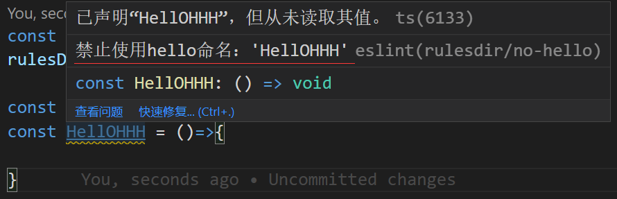

## ESLint

### 自动格式修复eslint + vscode + vetur
[vscode+vue+eslint统一风格配置](https://blog.csdn.net/kw023781/article/details/105825159)

### 自定义ESLint规则

1. 安装eslint-plugin-rulesdir插件
```sh
npm install eslint-plugin-rulesdir --save-dev
```

2. 在项目下新建文件夹custom_rules，来放我们自定义的规则，比如新建一个no-hello.js
```js
// custom_rules/no-hello.js
module.exports = {
  meta: {
    type: "suggestion",
    messages: {
      tip: "禁止使用hello命名：'{{ name }}'"
    }
  },
  create(context){
    return{
      Identifier(node) {
        if (node.name.toLocaleLowerCase().indexOf("hello") > -1) {
          context.report({
            node,
            messageId: "tip",
            data: {
                name: node.name,
            }
          });
        }
      }
    }
  }
}
```

3. 在.eslintrc.js文件最上面添加如下代码
```js
// .eslintrc.js
const rulesDirPlugin = require('eslint-plugin-rulesdir');

// 一个目录， 目录路径相对.eslintrc.js文件
rulesDirPlugin.RULES_DIR = 'custom_rules';
// 多个目录
rulesDirPlugin.RULES_DIR = ['custom_rules', 'custom_rules/vue'];

module.exports = {
  ...
  plugins: ['rulesdir'],
  rules: {
    'no-debugger': process.env.NODE_ENV === 'production' ? 'warn' : 'off',
    'rulesdir/no-hello': 'warn'
  }
}

```

4. 如果你的编译器配置了eslint提示，当你用hello命名变量时，就会看到黄色的波浪线了

5. 效果图


## 自定义规则API

### Identifier
变量声明选择器，入参node(变量节点)