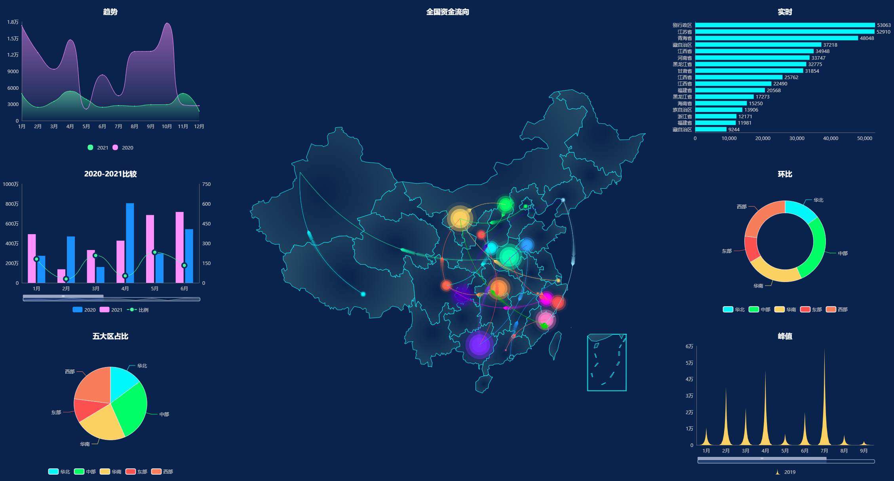
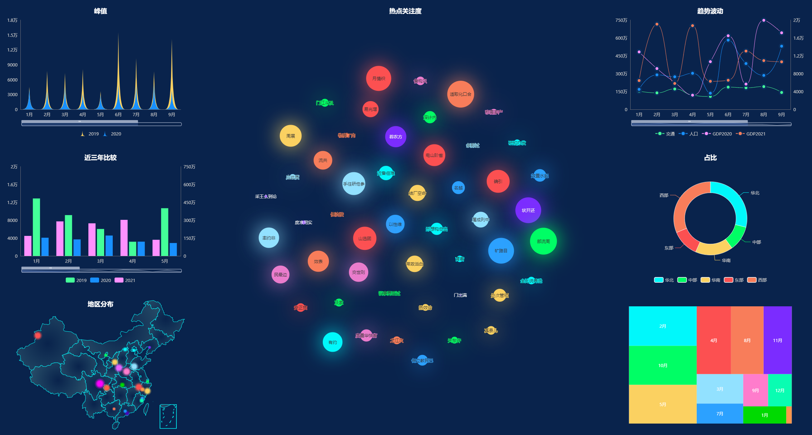

<h1 align="center">kidar-echarts 🍥 更简单的Echarts</h1>

  将必要有关联的配置属性进行封装，仅暴露用户可能自定义的配置选项，无需关注自适应、鼠标点击事件等操作，支持自定义插件，更好的复用配置

 具体可点击查看在线文档 ✨ <a href="https://kidarjs.github.io/kidar-echarts">Live Demo</a>

### 为什么选择KidarEcharts

随着数字化不断普及，数据量大爆发，很多企业都开始开发各种数据统计平台。

在使用大量echarts绘制不同图表的业务中，项目中花样繁多的option配置重复性很高，由于涉及到的配置项过多，编写顺序随意，很难将类似的图表进行整合，尽管项目也封装了一些通用配置echarts，但还是无法避免多人协作过程中的混用

编写冗长繁杂的option很痛苦，属性多得记不住，总是需要查看文档来进行配置

对于复杂一点的图表，option配置项多且冷门，网络上存在的echarts图表都是以demo的形式展现，且使用原生的echarts编码方式，难以阅读，开发人员很难学习使用

因此更贴合 Vue|React 使用者习惯的 KidarEcharts 组件，将会给你带来更舒适的开发体验，减少了echarts的学习成本。

KidarEcharts为了解决这个问题，将大家常用的option进行收集封装，通过懒加载的方式展现，减少echarts配置的学习成本。
并且支持自定义option文件，并通过安装插件的方式导入，方便复用。同时你也可以寻找社区分享的好用的option进行安装使用，我们仅需要关注图表所需数据格式、维度，就能画出漂亮的图表了。

### Now
目前组件还再完善中，也欢迎大家点评，如果你觉得这个组件还不错，也欢迎贡献代码，扩充更多好看的plugin
[makeapie](https://www.makeapie.com/explore.html),这个网站画的还不错，陆陆续续会集成过来
### 🔥 Features
每个组件实例都是一个echarts，切换不同的echarts采用懒加载技术，更快更简单的实现不同图形的展示

- [x] 快速绘制出简单图形，饼图、折线、柱状、环形、多样组合、地图
- [x] 支持自定义插件
- [x] 支持自适应宽高，当容器大小变化时自动适应
- [x] 支持Typescript
- [ ] 支持自定义参数，方便定制tooltip、label等
- [ ] 支持点击事件、鼠标移入移出事件
- [ ] 支持3D

### 效果图预览

### 涉及的技术
* vite
* vue-demi (使组件同时支持vue2、vue3)
* typescript
* echarts
* echarts-gl

