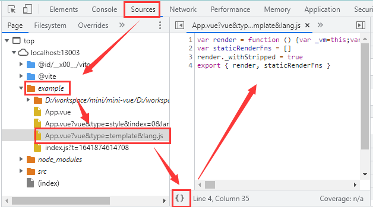

### v0.0.4 切换成vite，使用vue-template-compiler编译VUE文件
优化现有功能，并使用真实的VUE模板编译功能，对接vite的vite-plugin-vue2插件

[mini-vue 仓库源码](https://github.com/nkxrb/mini-vue/tree/v0.0.4)

功能点：
  - 引入vite + vite-plugin-vue2,在真实的开发场景中继续实现mini-vue的功能
  - 将app.js文件改成App.vue, 并保证现有功能都可用
  - 增加v-for指令的解析
  - 增加生命周期钩子函数

### 新增依赖

package.json 文件更改如下
```json
{
  "name": "mini-vue",
  "version": "1.0.0",
  "scripts": {
    "dev": "vite"
  },
  "devDependencies": {
    "vite": "^2.7.10",
    "vite-plugin-vue2": "^1.9.2",
    "vue": "^2.6.14",
    "vue-template-compiler": "^2.2.0"
  }
}
```

然后运行安装命令npm i 或者 pnpm i

### 修改app.js为App.vue
在example文件夹下，将app.js为App.vue

```vue
<template>
	<div>
		<h2>{{ title }}: {{ count }}</h2>
		<button @click="plus">+1</button><br />

		<h3>操作历史记录</h3>
		<div>
			<span v-for="(n, i) in countList" :key="n">
				{{ i }}. 第{{ n }}次点击: {{ n }} <button @click="del(i)">删除</button>
				<br />
			</span>
		</div>
	</div>
</template>

<script>
export default {
	data: function () {
		return {
			title: "",
			count: 0,
			test: 1001,
			countList: [],
		};
	},
	mounted() {
		this.title = "计数";
		Promise.resolve().then(() => {
			this.count = 1001;
		});
	},
	methods: {
		plus() {
			this.count++;
			this.countList = [...this.countList, this.count];
		},
		del(i) {
			this.countList.splice(i, 1);
			this.countList = [...this.countList];
		},
		testNoReactive() {
			// 测试修改test属性，不触发重新渲染
			console.log("testNoReactive", this.test++);
		},
	},
};
</script>

```

### 修改API
改完上面的文件后，运行程序，会看到控制台报错，提示vm._s为undefined
然后我们利用浏览器的源码映射功能，看下vue文件最终编译的结果
如下图所示


从这幅图中，我们就可以看出render函数的运行过程，从而对vm的全局API进行调整修改。

vm._s = val => val != null ? val.toString() : ''

vm._v = val => val

vm._self = vm

